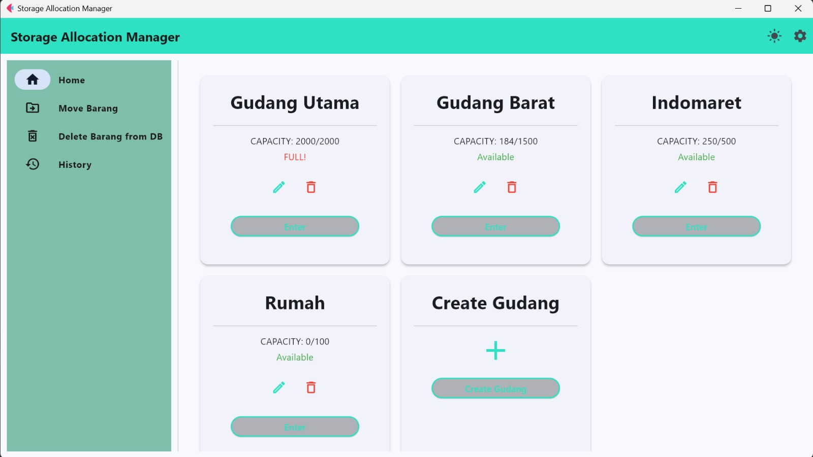

# STORAGE ALLOCATION MANAGER (S.A.M)

S.A.M, atau Storage Allocation Management, adalah aplikasi yang dirancang untuk mencatat dan mengelola aktivitas penyimpanan di gudang. Aplikasi ini memungkinkan pengguna untuk:

- Mencatat data gudang, termasuk nama dan ukuran setiap gudang.
- Mencatat barang yang disimpan di gudang, meliputi nama barang, jumlah, dan ukurannya.
- Mencatat perpindahan barang antar gudang, sehingga pengguna dapat melacak pergerakan barang dengan mudah.

Setiap aktivitas yang dilakukan akan tercatat di menu Riwayat yang terdapat di aplikasi.

## Anggota Kelompok

| No  | NIM      | Nama                      |
| :-- | -------- | ------------------------- |
| 1   | 13122080 | Adi Haditya Nursyam       |
| 2   | 13523064 | Samuel Gerrard H. Girsang |
| 3   | 13523030 | Julius Arthur             |   
| 4   | 13523076 | Nadhif Al Rozin           |     
| 5   | 13523084 | Lutfi Hakim Yusra         |     

## Cara Menjalankan Aplikasi

1. Setup virtual environment dengan menjalankan command berikut di terminal:
   `python -m venv venv`

2. Aktifkan virtual environment dengan menjalankan command berikut di terminal:

   - MacOS / Linux :
     `source venv/bin/activate`
   - Windows :
     `venv\Scripts\activate`

3. Install semua library yang diperlukan dengan menjalankan command berikut di terminal:
   `pip install -r requirements.txt`

4. Install routing:
   `cd src`
   `pip intall -e .`

5. Run program dengan menjalankan command berikut di terminal:
   `python frontend/main.py`

6. Jika ingin menambahkan admin, masukkan ke `admins.json`

```json
{
  "admin1": {
    "password_hash": "5e884898da28047151d0e56f8dc6292773603d0d6aabbdd62a11ef721d1542d8",
    "role": "admin"
  },
  "admin2": {
    "password_hash": "5e884898da28047151d0e56f8dc6292773603d0d6aabbdd62a11ef721d1542d8",
    "role": "admin"
  },
  "admin3": {
    "password_hash": "5e884898da28047151d0e56f8dc6292773603d0d6aabbdd62a11ef721d1542d8",
    "role": "admin"
  }
}
```

## Daftar Modul Implementasi

| No  | Nama Modul | Assigned to               | Tampilan Layar                   |
| :-- | ---------- | ------------------------- | -------------------------------- |
| 1   | Login      | Adi Haditya Nursyam       |        |
| 2   | Gudang     | Samuel Gerrard H. Girsang |      |
| 3   | Barang     | Julius Arthur             |      |
| 4   | Riwayat    | Nadhif Al Rozin           |    |
| 5   | Database   | Lutfi Hakim Yusra         |  |
| 6   | Template   | Adi Haditya Nursyam       |        |

## Tabel Basis Data

#### Tabel Admin

| Nama Kolom | Tipe   | Lebar | Untuk Menampung Data   |
| :--------- | ------ | ----- | ---------------------- |
| username   | string | 20    | username unik admin    |
| password   | string | 20    | password dari username |

#### Tabel Gudang

| Nama Kolom   | Tipe               | Lebar | Untuk Menampung Data                                                |
| :----------- | ------------------ | ----- | ------------------------------------------------------------------- |
| id           | integer            | 1     | id unik untuk tiap gudang                                           |
| nama gudang  | string             | 30    | nama unik untuk tiap gudang                                         |
| capacity     | integer            | 1     | nilai isi gudang                                                    |
| max capacity | integer            | 30    | kapasitas maksimum gudang                                           |
| list barang  | array of tuple int | 1     | Array of tuple integer yang menyimpan id barang dan quantity barang |

#### Tabel Barang

| Nama Kolom | Tipe             | Lebar | Untuk Menampung Data        |
| :--------- | ---------------- | ----- | --------------------------- |
| id         | integer          | 1     | id unik untuk tiap gudang   |
| name       | string           | 30    | nama unik untuk tiap gudang |
| capacity   | integer          | 1     | nilai isi gudang            |
| gudang     | array of integer |       | kapasitas maksimum gudang   |

#### Tabel Riwayat

| Nama Kolom  | Tipe             | Lebar | Untuk Menampung Data                 |
| :---------- | ---------------- | ----- | ------------------------------------ |
| id          | integer          | 1     | kode unik untuk tiap riwayat         |
| value       | array of integer | 4     | data yang digunakan sesuai kode aksi |
| action code | character        | 2     | kode untuk suatu aksi oleh admin     |
| timestamp   | string           | 1     | waktu aksi dilakukan                 |
